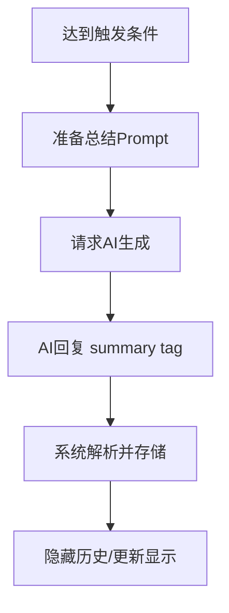

[English](en/03-summary-system.md) | 中文

# 03 - 总结系统设计

本文档定义Bulimia模块系统的总结系统，包括操作总结、模块总结、插件总结和全局总结的完整设计。

**目标**: 自动压缩对话历史，减少token消耗，提高AI上下文利用效率，同时避免AI重复操作。

---

## 一、操作总结（Operation Summary）

### 设计目的

⚠️ **核心问题**: 防止AI重复执行相同操作（如反复加分扣分）

💡 **解决方案**: 自动记录最近N次操作，发送给AI作为参考

### 配置参数

```json
{
  "operationSummary": {
    "enabled": true,
    "recentInteractionCount": 2,
    "displayInPrompt": true
  }
}
```

| 参数 | 类型 | 说明 |
|------|------|------|
| `enabled` | boolean | 是否启用操作总结 |
| `recentInteractionCount` | number | 保留最近N次交互的操作（不是总操作数） |
| `displayInPrompt` | boolean | 是否在Prompt中显示 |

⚠️ **交互定义**: 1次交互 = 1次对话轮次（用户输入 + AI回复）

💡 **示例**: `recentInteractionCount = 2` 表示保留最近2次对话中的所有操作

### 记录的操作类型

系统自动记录以下操作：

1. **变量操作**: `<var|...>` 和 `<rule|...>`
2. **模块操作**: `<module|enter|...>` 和 `<module|complete|...>`
3. **投递信息**: `<delivery|...|done>`
4. **中断决策**: `<interrupt|...>`

### Prompt发送格式

````markdown
```operations
【最近操作】
1. <rule|score|考试通过加分> (执行时间: 2024-08-01 14:30)
2. <module|complete|homework> (执行时间: 2024-08-01 14:35)
3. <delivery|重要通知|done> (执行时间: 2024-08-01 14:40)
4. <rule|friends|增加好感度|index=0> (执行时间: 2024-08-01 14:45)
5. <module|enter|exam> (执行时间: 2024-08-01 14:50)
```
````

### 最佳实践

- **推荐值**: recentCount = 5-10
- **作用**: AI看到最近操作后，会避免重复执行
- **示例**: 如果AI刚执行过"考试通过加分"，看到记录后不会再次加分

---

## 二、全局总结（Global Summary）

### 设计特性

- **始终发送**: 每次Prompt生成时都发送
- **多层结构**: 单条总结 + 大总结 + 原始消息
- **定期压缩**: 单条总结达到一定数量后压缩为大总结
- **可编辑**: 用户可在调试面板查看和编辑

### 配置参数

```json
{
  "globalSummary": {
    "enabled": true,
    "summarizeEveryMessage": true,
    "keepRecentOriginalMessages": 3,
    "keepRecentSingleSummaries": 5,
    "compressSummariesEvery": 10,
    "autoHideOlder": true
  }
}
```

| 参数 | 类型 | 说明 |
|------|------|------|
| `enabled` | boolean | 是否启用全局总结 |
| `summarizeEveryMessage` | boolean | 每条消息都要求AI生成单条总结 |
| `keepRecentOriginalMessages` | number | 保留最近M条原始消息 |
| `keepRecentSingleSummaries` | number | 保留最近N条单条总结消息 |
| `compressSummariesEvery` | number | 每N条单条总结压缩为1个大总结 |
| `autoHideOlder` | boolean | 自动隐藏旧单条总结，仅发送大总结 |

### 总结层次结构

```
【大总结】 (由多条单条总结压缩而成)
  ↓
【单条总结 1-5】 (每条消息生成的总结)
  ↓
【原始消息 1-3】 (最近的对话)
```

### Prompt发送逻辑

````markdown
```global_summary
【大总结】
玩家开始了校园生活，经历了入学、第一学期的各种事件。与张三的关系逐渐改善，从陌生到成为好友。参加了多次考试，分数从60提升到75。

【最近5条单条总结】
1. 玩家决定去图书馆学习
2. 在图书馆认真复习数学
3. 参加数学考试，考试过程顺利
4. 考试成绩不错，分数提升了10分
5. 与张三分享了考试结果，关系更进一步

【最近3条原始消息】
- User: 我想去图书馆学习
- AI: 你来到了图书馆，找到了一个安静的角落...
- User: 开始复习数学
```
````

### 总结生成流程

1. **触发条件**: 达到`summarizeEvery`设定的消息数量
2. **请求AI**: 系统自动发送特殊prompt要求AI生成总结
3. **AI回复**: 使用格式 `<summary|global|总结内容>`
4. **系统处理**: 自动替换旧总结，隐藏历史消息
5. **用户编辑**: 可在调试面板手动编辑总结

---

## 三、模块总结（Module Summary）

### 设计特性

- **可选配置**: 不是所有模块都需要总结，在module定义中配置
- **作用域控制**: 总结发送遵循作用域规则
- **状态关联**: 模块entered时发送，completed后隐藏

### 作用域规则

⚠️ **核心规则**: 同父级模块间互相发送子模块总结，跨父级只发送父级总结

**示例结构**:
```
第一学期 (父级)
├── 数学课程 (子模块)
├── 英语课程 (子模块)
└── 体育课程 (子模块)

第二学期 (父级)
├── 物理课程 (子模块)
└── 化学课程 (子模块)
```

**发送逻辑**:
- 在"数学课程"中 → 发送"英语课程"和"体育课程"的总结
- 在"数学课程"中 → 不发送"物理课程"的总结，仅发送"第二学期"父级总结
- 在"第二学期"中 → 发送"第一学期"的父级总结（不包含其子模块详情）

### 模块定义

```json
{
  "id": "semester1",
  "name": "第一学期",
  "summary": {
    "enabled": true,
    "autoSummarize": true,
    "promptList": [
      {
        "condition": [ConditionDef],
        "content": ""
      }
    ]
  }
}
```

### Prompt发送格式

````markdown
```module_summary
【相关模块总结】

[当前父级: 第一学期]
- 数学课程: 已完成3次作业，分数从60提升到75
- 英语课程: 进行中，完成了2次测验

[父级模块: 入学准备]
完成了报名、体检和入学测试，顺利入学
```
````

### 总结条无 condition 时的默认行为

某条 `promptList` 的 `condition` 为空或省略时：**该条在该模块内的每个子模块完成时各总结一次**（即每个直属子模块完成都会触发一次该条的总结生成/展示）。设计时不必写默认说明，实现按此处理。

### 总结时机

- **进入时**: 发送相关模块的总结
- **进行中**: 持续更新当前模块总结
- **完成时**: 请求AI生成最终总结，然后隐藏

---

## 四、插件总结（Plugin Summary）

### 设计目的

💡 **核心思想**: 插件总结记录事件，非对话

### 适用场景

- **特殊事件**: 战斗胜利、任务完成、成就解锁
- **状态变化**: 属性提升、关系变化、物品获得
- **重要决策**: 关键选择、分支触发

⚠️ **重要**:
- **插件自己决定prompt**: 每个插件自己定义总结内容格式
- **大部分通过内置生成**: 操作和变量变化都有记录，自动生成总结
- **存档保留原始数据**: 存本地不消耗资源，保留完整历史
- **通常用不到**: 大部分插件不需要额外总结，需要会在插件内置


## 五、NPC总结（NPC Summary）

### 设计特性

NPC总结是分流程总结的特殊应用，按照NPC分流程设计进行。

### 总结内容

⚠️ **区分重要**:
- **关系数值**: 是**变量**，不是总结（如好感度、信任度、亲密度）
- **主观看法**: 是**总结**（如NPC对玩家的印象、评价）

**总结内容**可包含双方经历、当前印象等，由 `promptList[].content` 的占位或说明描述；**配置格式与模块总结完全一致**，无单独 type/sections。

### NPC分流程配置

分流程（含 NPC）的 `summary` 与模块总结**同一格式**：`enabled`、`autoSummarize?`、`promptList: [{ condition, content }]`。

```json
{
  "flowId": "npc_zhang_san",
  "flowName": "张三",
  "variables": [
    {
      "id": "affection",
      "name": "好感度",
      "type": "number",
      "initialValue": 50
    },
    {
      "id": "trust",
      "name": "信任度",
      "type": "number",
      "initialValue": 30
    }
  ],
  "summary": {
    "enabled": true,
    "autoSummarize": true,
    "promptList": [
      {
        "condition": [ConditionDef],
        "content": ""
      }
    ]
  }
}
```

⚠️ **Prompt List**: 满足 condition 时使用该条 `content` 生成/展示总结；与模块总结一致。

### Prompt发送格式

````markdown
```npc_summary_zhang_san
【张三 - 关系总结】

印象: 友好的同学
关系: 好感度60 / 信任度45 / 亲密度30

经历: 
- 初次见面时有些拘谨，后来逐渐熟悉
- 一起完成了数学作业，关系有所改善
- 借给对方笔记本，信任度提升
```
````

---

## 六、总结管理调试面板

### 面板布局

```
┌─ 总结管理 ─────────────────────────────────────────────┐
│ 【全局总结】                                           │
│ ┌───────────────────────────────────────────────────┐ │
│ │ 玩家开始了校园生活，经历了入学、第一学期的各种    │ │
│ │ 事件，结识了朋友...                               │ │
│ │                                                   │ │
│ │ [编辑] [重新生成]                                 │ │
│ └───────────────────────────────────────────────────┘ │
│                                                        │
│ 配置:                                                  │
│ ☑ 启用全局总结                                        │
│ ☑ 每条消息生成单条总结                                │
│ 保留最近 [5▼] 条原始消息                              │
│ 保留最近 [15▼] 条单条总结                              │
│ 每 [20▼] 条单条总结压缩为大总结                       │
│                                                        │
│ 【操作总结】                                           │
│ 保留最近 [2▼] 次交互的操作                            │
│ ☑ 在Prompt中显示                                      │
│                                                        │
│ 【模块总结】                                           │
│ ├─ 第一学期 [已启用] [编辑]                           │
│ │   已完成3次作业，分数从60提升到75                   │
│ ├─ 好友系统 [已启用] [编辑]                           │
│ └─ ...                                                 │
│                                                        │
│ 【插件总结】                                           │
│ ├─ battle_system [已启用] [查看事件 15条]             │
│ └─ ...                                                 │
│                                                        │
│ 【NPC总结】                                            │
│ ├─ 张三 [好感度60] [编辑关系]                         │
│ └─ 李四 [好感度45] [编辑关系]                         │
└────────────────────────────────────────────────────────┘
```

### 功能列表

1. **查看总结**: 展示所有层级的总结内容
2. **编辑总结**: 手动修改总结文本
3. **重新生成**: 请求AI重新生成总结
4. **配置参数**: 调整总结频率、保留数量等
5. **事件查看**: 查看插件记录的详细事件

---

## 七、总结生成流程

### 自动生成



### 触发条件

| 总结类型 | 触发条件 |
|---------|---------|
| 全局总结 | 每N条消息 |
| 模块总结 | 模块完成时 |
| 插件总结 | 事件发生时或手动 |
| NPC总结 | 互动后或手动 |

### AI生成Prompt

**全局总结请求**:
```
请根据以下对话历史，生成简洁的总结（约100-200字）：

[对话历史]
...

请使用格式: <summary|global|总结内容>
```

**模块总结请求**:
```
请总结"第一学期"模块的主要进展（约50-100字）：

[模块相关对话]
...

请使用格式: <summary|module|总结内容>
```

---

## 八、最佳实践

### 配置建议

| 参数 | 推荐值 | 说明 |
|------|-------|------|
| 压缩大总结频率 | 10-15条单条总结 | 平衡压缩效果和上下文连贯性 |
| 保留原始消息 | 3条 | 保持近期对话细节 |
| 保留单条总结 | 5条 | 在压缩为大总结之前的缓冲 |
| 操作记录交互数 | 2次 | 最近2次对话的操作，足够AI判断 |

### 注意事项

⚠️ **重要原则**:
1. 总结应简洁，避免冗长描述
2. 保留关键信息（人物、事件、决策）
3. 定期检查总结质量，必要时手动编辑
4. 操作总结自动化，无需AI生成

💡 **优化技巧**:
- 跨父级模块时只发送父级总结，避免信息过载
- 插件总结记录事件而非对话，更精准
- NPC总结包含多维度关系，而非单一好感度

---

**文档版本**: 1.0
**最后更新**: 2026-02-05
