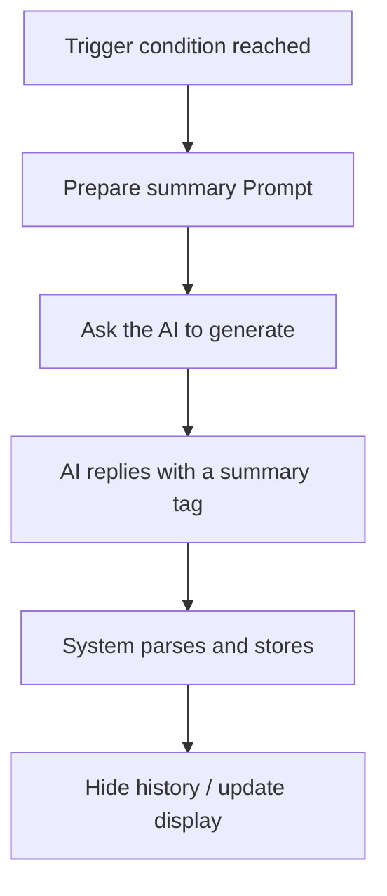

English | [中文](../03-summary-system.md)

# 03 - Summary System Design

This document defines the summary system of the Bulimia module system, including the complete design of operation summaries, module summaries, plugin summaries and the global summary.

**Goal**: Automatically compress conversation history, reduce token consumption, improve the AI's use of context, and prevent the AI from repeating operations.

---

## 1. Operation Summary

### Design purpose

⚠️ **Core problem**: Prevent the AI from repeatedly performing the same operation (such as repeatedly adding and deducting points)

💡 **Solution**: Automatically record the most recent N operations and send them to the AI as a reference

### Configuration parameters

```json
{
  "operationSummary": {
    "enabled": true,
    "recentInteractionCount": 2,
    "displayInPrompt": true
  }
}
```

| Parameter | Type | Description |
|------|------|------|
| `enabled` | boolean | Whether operation summaries are enabled |
| `recentInteractionCount` | number | Keep the operations of the most recent N interactions (not the total number of operations) |
| `displayInPrompt` | boolean | Whether to show them in the Prompt |

⚠️ **Definition of an interaction**: 1 interaction = 1 conversation round (user input + AI reply)

💡 **Example**: `recentInteractionCount = 2` means keeping all operations from the most recent 2 conversation rounds

### Recorded operation types

The system automatically records the following operations:

1. **Variable operations**: `<var|...>` and `<rule|...>`
2. **Module operations**: `<module|enter|...>` and `<module|complete|...>`
3. **Delivery info**: `<delivery|...|done>`
4. **Interruption decisions**: `<interrupt|...>`

### Prompt format

````markdown
```operations
[Recent operations]
1. <rule|score|Exam passed bonus> (executed at: 2024-08-01 14:30)
2. <module|complete|homework> (executed at: 2024-08-01 14:35)
3. <delivery|Important Notice|done> (executed at: 2024-08-01 14:40)
4. <rule|friends|Increase affection|index=0> (executed at: 2024-08-01 14:45)
5. <module|enter|exam> (executed at: 2024-08-01 14:50)
```
````

### Best practices

- **Recommended value**: recentCount = 5-10
- **Effect**: after seeing the recent operations, the AI avoids repeating them
- **Example**: if the AI has just executed "Exam passed bonus", it will not add points again after seeing the record

---

## 2. Global Summary

### Design characteristics

- **Always sent**: sent every time a Prompt is generated
- **Multi-layer structure**: single summaries + large summary + original messages
- **Periodic compression**: once single summaries reach a certain number they are compressed into a large summary
- **Editable**: users can view and edit it in the debug panel

### Configuration parameters

```json
{
  "globalSummary": {
    "enabled": true,
    "summarizeEveryMessage": true,
    "keepRecentOriginalMessages": 3,
    "keepRecentSingleSummaries": 5,
    "compressSummariesEvery": 10,
    "autoHideOlder": true
  }
}
```

| Parameter | Type | Description |
|------|------|------|
| `enabled` | boolean | Whether the global summary is enabled |
| `summarizeEveryMessage` | boolean | Ask the AI to generate a single summary for every message |
| `keepRecentOriginalMessages` | number | Keep the most recent M original messages |
| `keepRecentSingleSummaries` | number | Keep the most recent N single-summary messages |
| `compressSummariesEvery` | number | Compress every N single summaries into 1 large summary |
| `autoHideOlder` | boolean | Automatically hide older single summaries and send only the large summary |

### Summary hierarchy

```
[Large summary] (compressed from multiple single summaries)
  ↓
[Single summaries 1-5] (summaries generated for each message)
  ↓
[Original messages 1-3] (the most recent conversation)
```

### Prompt sending logic

````markdown
```global_summary
[Large summary]
The player began campus life and went through enrollment and various events of the first semester. The relationship with Zhang San gradually improved, from strangers to friends. Took several exams, with the score rising from 60 to 75.

[Most recent 5 single summaries]
1. The player decided to go study at the library
2. Reviewed math seriously at the library
3. Took the math exam, which went smoothly
4. Did well on the exam; the score rose by 10 points
5. Shared the exam result with Zhang San, and the relationship went a step further

[Most recent 3 original messages]
- User: I want to go study at the library
- AI: You arrive at the library and find a quiet corner...
- User: Start reviewing math
```
````

### Summary generation flow

1. **Trigger**: the message count set by `summarizeEvery` is reached
2. **Ask the AI**: the system automatically sends a special prompt asking the AI to generate a summary
3. **AI reply**: uses the format `<summary|global|summary content>`
4. **System handling**: automatically replaces the old summary and hides historical messages
5. **User editing**: the summary can be edited manually in the debug panel

---

## 3. Module Summary

### Design characteristics

- **Optional configuration**: not every module needs a summary; it is configured in the module definition
- **Scope control**: summary sending follows the scope rules
- **State association**: sent when the module is entered, hidden after completed

### Scope rules

⚠️ **Core rule**: Sibling modules under the same parent send their child-module summaries to each other; across parents, only the parent's summary is sent

**Example structure**:
```
Semester 1 (parent)
├── Math Course (child module)
├── English Course (child module)
└── PE Course (child module)

Semester 2 (parent)
├── Physics Course (child module)
└── Chemistry Course (child module)
```

**Sending logic**:
- In "Math Course" → send the summaries of "English Course" and "PE Course"
- In "Math Course" → do not send the summary of "Physics Course"; send only the parent summary of "Semester 2"
- In "Semester 2" → send the parent summary of "Semester 1" (without its child module details)

### Module definition

```json
{
  "id": "semester1",
  "name": "Semester 1",
  "summary": {
    "enabled": true,
    "autoSummarize": true,
    "promptList": [
      {
        "condition": [ConditionDef],
        "content": ""
      }
    ]
  }
}
```

### Prompt format

````markdown
```module_summary
[Related module summaries]

[Current parent: Semester 1]
- Math Course: Completed 3 homework assignments; score rose from 60 to 75
- English Course: In progress; completed 2 quizzes

[Parent module: Enrollment Preparation]
Completed registration, a medical exam and entrance tests, and enrolled smoothly
```
````

### Default behavior when a summary entry has no condition

When a `promptList` entry's `condition` is empty or omitted: **that entry summarizes once each time a child module within the module is completed** (i.e. the completion of every direct child module triggers one generation/display of that entry's summary). There is no need to write this default explanation in designs; the implementation handles it accordingly.

### Summary timing

- **On enter**: send the summaries of related modules
- **In progress**: keep updating the current module's summary
- **On completion**: ask the AI to generate the final summary, then hide it

---

## 4. Plugin Summary

### Design purpose

💡 **Core idea**: A plugin summary records events, not conversation

### Use cases

- **Special events**: combat victory, task completion, achievement unlocked
- **State changes**: attribute increase, relationship change, item acquired
- **Important decisions**: key choices, branch triggers

⚠️ **Important**:
- **Plugins decide their own prompts**: each plugin defines its own summary content format
- **Mostly generated by built-ins**: operations and variable changes are all recorded, and summaries are generated automatically
- **Saves retain raw data**: stored locally at no resource cost, preserving the complete history
- **Usually unnecessary**: most plugins do not need an extra summary; if needed it is built into the plugin


## 5. NPC Summary

### Design characteristics

An NPC summary is a special application of sub-flow summaries, following the NPC sub-flow design.

### Summary content

⚠️ **Distinguishing matters**:
- **Relationship values**: are **variables**, not summaries (such as affection, trust, intimacy)
- **Subjective views**: are **summaries** (such as the NPC's impression or evaluation of the player)

The **summary content** may include both sides' experiences, the current impression, and so on, described by the placeholder or note in `promptList[].content`; **the config format is identical to module summaries**, with no separate type/sections.

### NPC sub-flow configuration

The `summary` of a sub-flow (including an NPC) uses the **same format** as module summaries: `enabled`, `autoSummarize?`, `promptList: [{ condition, content }]`.

```json
{
  "flowId": "npc_zhang_san",
  "flowName": "Zhang San",
  "variables": [
    {
      "id": "affection",
      "name": "Affection",
      "type": "number",
      "initialValue": 50
    },
    {
      "id": "trust",
      "name": "Trust",
      "type": "number",
      "initialValue": 30
    }
  ],
  "summary": {
    "enabled": true,
    "autoSummarize": true,
    "promptList": [
      {
        "condition": [ConditionDef],
        "content": ""
      }
    ]
  }
}
```

⚠️ **Prompt List**: when the condition is met, that entry's `content` is used to generate/show the summary; the same as for module summaries.

### Prompt format

````markdown
```npc_summary_zhang_san
[Zhang San - Relationship summary]

Impression: a friendly classmate
Relationship: affection 60 / trust 45 / intimacy 30

Experiences:
- A bit reserved at the first meeting, gradually became familiar
- Completed the math homework together, and the relationship improved
- Lent a notebook, raising trust
```
````

---

## 6. Summary Management Debug Panel

### Panel layout

```
┌─ Summary Management ───────────────────────────────────┐
│ [Global summary]                                       │
│ ┌───────────────────────────────────────────────────┐ │
│ │ The player began campus life and went through     │ │
│ │ enrollment and various events of the first        │ │
│ │ semester, making friends...                       │ │
│ │                                                   │ │
│ │ [Edit] [Regenerate]                               │ │
│ └───────────────────────────────────────────────────┘ │
│                                                        │
│ Config:                                                │
│ ☑ Enable global summary                               │
│ ☑ Generate a single summary for every message         │
│ Keep the most recent [5▼] original messages           │
│ Keep the most recent [15▼] single summaries           │
│ Compress every [20▼] single summaries into a large one│
│                                                        │
│ [Operation summary]                                    │
│ Keep operations of the most recent [2▼] interactions  │
│ ☑ Show in Prompt                                      │
│                                                        │
│ [Module summaries]                                     │
│ ├─ Semester 1 [Enabled] [Edit]                        │
│ │   Completed 3 homework assignments; score 60 → 75   │
│ ├─ Friend System [Enabled] [Edit]                     │
│ └─ ...                                                 │
│                                                        │
│ [Plugin summaries]                                     │
│ ├─ battle_system [Enabled] [View events: 15]          │
│ └─ ...                                                 │
│                                                        │
│ [NPC summaries]                                        │
│ ├─ Zhang San [Affection 60] [Edit relationship]       │
│ └─ Li Si [Affection 45] [Edit relationship]           │
└────────────────────────────────────────────────────────┘
```

### Feature list

1. **View summaries**: show the summary content of every level
2. **Edit summaries**: manually modify the summary text
3. **Regenerate**: ask the AI to regenerate the summary
4. **Configure parameters**: adjust summary frequency, retention counts and so on
5. **View events**: view the detailed events recorded by plugins

---

## 7. Summary Generation Flow

### Automatic generation



### Trigger conditions

| Summary type | Trigger condition |
|---------|---------|
| Global summary | Every N messages |
| Module summary | When the module is completed |
| Plugin summary | When an event occurs, or manually |
| NPC summary | After an interaction, or manually |

### AI generation Prompts

**Global summary request**:
```
Based on the following conversation history, generate a concise summary (about 100-200 words):

[Conversation history]
...

Please use the format: <summary|global|summary content>
```

**Module summary request**:
```
Please summarize the main progress of the "Semester 1" module (about 50-100 words):

[Module-related conversation]
...

Please use the format: <summary|module|summary content>
```

---

## 8. Best Practices

### Configuration suggestions

| Parameter | Recommended value | Description |
|------|-------|------|
| Large-summary compression frequency | 10-15 single summaries | Balances compression effect and context coherence |
| Original messages kept | 3 | Preserves recent conversation detail |
| Single summaries kept | 5 | A buffer before compression into a large summary |
| Interactions of operation records | 2 | Operations of the last 2 conversation rounds, enough for the AI to judge |

### Notes

⚠️ **Important principles**:
1. Summaries should be concise; avoid lengthy descriptions
2. Keep key information (characters, events, decisions)
3. Check summary quality periodically and edit manually when needed
4. Operation summaries are automated and need no AI generation

💡 **Optimization tips**:
- When crossing parent modules, send only the parent summary to avoid information overload
- Plugin summaries record events rather than conversation, which is more precise
- NPC summaries contain multi-dimensional relationships rather than a single affection value

---

**Document version**: 1.0
**Last updated**: 2026-02-05
